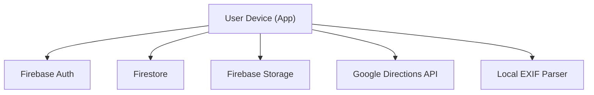

## Executive summary
This mobile app is a public consumer Flutter client that relies on Firebase Auth, Firestore, and Firebase Storage plus Google Maps/Directions. The highest-risk themes are privacy exposure of user-submitted photos and precise locations (readable by any authenticated user), admin workflow integrity (admin UI is not gated client-side while server rules rely on custom claims), and abuse of submission/reporting flows (spamming or poisoning speed bump data). The most sensitive areas are submission storage/metadata access, Firestore rules around submissions and speed bumps, and the admin review/approval path.

## Scope and assumptions
- In-scope paths: `/Users/me/speed bump/lib`, `/Users/me/speed bump/firestore.rules`, `/Users/me/speed bump/storage.rules`, `/Users/me/speed bump/pubspec.yaml`, `/Users/me/speed bump/README.md`, `/Users/me/speed bump/ABOUT.md`.
- Out-of-scope: CI/build tooling, tests, platform-specific native code unless directly referenced by the app runtime (iOS/Android project folders not reviewed).
- Assumptions:
  - Public consumer app targeting 1,000+ downloads initially with growth to 25,000+ users and multi-city expansion (from user input; roadmap referenced in `/Users/me/speed bump/ABOUT.md`).
  - All authenticated users can read all submissions and submission photos, per Firestore/Storage rules (`/Users/me/speed bump/firestore.rules`, `/Users/me/speed bump/storage.rules`).
  - Admin privileges are enforced server-side via Firebase custom claims; client-side admin UI does not check claim (`/Users/me/speed bump/firestore.rules`, `/Users/me/speed bump/lib/features/admin/presentation/screens/review_submission_screen.dart`).

Open questions that could change risk ranking:
- Whether a future version will restrict read access to submissions/photos by role or by ownership.
- Whether admin actions will move to a separate admin-only app or include strong client-side gating.
- Whether submissions will become searchable/map-visible to all users (beyond admin review).

## System model
### Primary components
- Mobile client (Flutter + Riverpod) with auth gates and navigation (`/Users/me/speed bump/lib/main.dart`, `/Users/me/speed bump/lib/core/routes/app_router.dart`).
- Firebase Auth for email/password and Google Sign-In (`/Users/me/speed bump/lib/features/auth/data/datasources/firebase_auth_datasource.dart`).
- Firestore for users, submissions, speed bump records (`/Users/me/speed bump/lib/features/auth/data/datasources/firestore_user_datasource.dart`, `/Users/me/speed bump/lib/features/submission/data/datasources/firestore_submission_datasource.dart`, `/Users/me/speed bump/lib/features/admin/data/datasources/firestore_speed_bump_datasource.dart`).
- Firebase Storage for submission photos (`/Users/me/speed bump/lib/features/submission/data/datasources/firebase_storage_datasource.dart`).
- Google Maps SDK + Directions API (routing and map display) (`/Users/me/speed bump/lib/features/routing/data/datasources/google_directions_api.dart`, `/Users/me/speed bump/lib/features/map/presentation/screens/map_screen.dart`).
- Local asset-based speed bump data for map display (Phase 1) (`/Users/me/speed bump/lib/features/routing/data/repositories/asset_speed_bump_repository.dart`).

### Data flows and trust boundaries
- Internet (User device) → Firebase Auth
  - Data: email/password, OAuth tokens
  - Protocol: HTTPS (Firebase SDK)
  - Security: Firebase Auth, TLS, SDK-managed token handling
  - Validation: Firebase Auth backend; client-side form validation (`/Users/me/speed bump/lib/features/auth/presentation/screens/auth_screen.dart`, `/Users/me/speed bump/lib/features/auth/data/datasources/firebase_auth_datasource.dart`).
- Mobile app → Firestore (users/submissions/speed_bumps)
  - Data: user profile, submission metadata (userId, email, photoUrl, location, severity, notes), speed bump records
  - Protocol: HTTPS (Firestore SDK)
  - Security: Firestore security rules; admin claim checks for privileged updates (`/Users/me/speed bump/firestore.rules`, `/Users/me/speed bump/lib/features/submission/data/datasources/firestore_submission_datasource.dart`).
  - Validation: rules for ownership/admin on write; limited schema enforcement in app; submission status enforced in rules (`/Users/me/speed bump/firestore.rules`, `/Users/me/speed bump/lib/features/submission/data/models/submission_model.dart`).
- Mobile app → Firebase Storage (submission photos)
  - Data: image files; download URLs stored in Firestore
  - Protocol: HTTPS (Storage SDK)
  - Security: Storage rules restrict create to owner and size/content-type; read allowed for any authenticated user (`/Users/me/speed bump/storage.rules`, `/Users/me/speed bump/lib/features/submission/data/datasources/firebase_storage_datasource.dart`).
- Mobile app → Google Directions API
  - Data: origin/destination/waypoints
  - Protocol: HTTPS (HTTP client)
  - Security: API key set via build-time env; no server-side proxy (`/Users/me/speed bump/lib/core/constants/api_constants.dart`, `/Users/me/speed bump/lib/features/routing/data/datasources/google_directions_api.dart`).
- Mobile app → EXIF parser
  - Data: local image file bytes
  - Protocol: local file IO
  - Security: no sandboxing beyond app runtime; EXIF parsing may be attacker-controlled if user selects arbitrary image (`/Users/me/speed bump/lib/core/utils/exif_extractor.dart`, `/Users/me/speed bump/lib/features/submission/presentation/screens/submission_form_screen.dart`).

#### Diagram

## Assets and security objectives
| Asset | Why it matters | Security objective (C/I/A) |
| --- | --- | --- |
| Submission photos and metadata (location, notes, userId/email) | Can reveal sensitive locations and identity; privacy risk | C, I |
| Firebase Auth tokens/session | Enables access to submissions and storage | C, I |
| Admin approval workflow and speed bump records | Integrity of public data and user trust | I, A |
| Firebase Storage objects (photos) | Privacy exposure if broadly readable | C |
| Firestore submissions collection | Privacy exposure and data integrity | C, I |
| Google Directions API key | Abuse could cause billing or service denial | C, A |
| User profile data (email, displayName, reputation) | PII; abuse affects user trust | C, I |

## Attacker model
### Capabilities
- Remote attacker can register a normal user account (email/password or Google Sign-In) and authenticate.
- Authenticated attacker can read all submissions and photos (per rules) and can submit photos/metadata.
- Attacker can manipulate client behavior (modified app, API calls) to attempt writes that rules permit.
- Attacker can attempt to spam submissions or uploads within storage rules.

### Non-capabilities
- Attacker cannot write/update admin-only records unless they obtain a valid `admin` custom claim (server-side rules).
- Attacker cannot access Firebase project config/keys beyond what is bundled in the app (not verified in repo).
- Attacker does not have server-side access to Firebase Admin SDK by default.

## Entry points and attack surfaces
| Surface | How reached | Trust boundary | Notes | Evidence (repo path / symbol) |
| --- | --- | --- | --- | --- |
| Auth login/signup | App UI → Firebase Auth | User device → Firebase Auth | Email/password + Google Sign-In | `/Users/me/speed bump/lib/features/auth/presentation/screens/auth_screen.dart`, `/Users/me/speed bump/lib/features/auth/data/datasources/firebase_auth_datasource.dart` |
| Submission create | App UI → Firestore | User device → Firestore | Metadata includes location, severity, notes | `/Users/me/speed bump/lib/features/submission/data/repositories/firebase_submission_repository.dart`, `/Users/me/speed bump/firestore.rules` |
| Submission photo upload | App UI → Firebase Storage | User device → Storage | Images uploaded under `submissions/{userId}` | `/Users/me/speed bump/lib/features/submission/data/datasources/firebase_storage_datasource.dart`, `/Users/me/speed bump/storage.rules` |
| Submission read (any user) | App UI → Firestore/Storage | User device → Firestore/Storage | Any authenticated user can read all submissions/photos | `/Users/me/speed bump/firestore.rules`, `/Users/me/speed bump/storage.rules` |
| Admin review/approve | App UI → Firestore | User device → Firestore | UI doesn’t enforce admin claim | `/Users/me/speed bump/lib/features/admin/presentation/screens/review_submission_screen.dart`, `/Users/me/speed bump/firestore.rules` |
| Directions API request | App → Google Directions API | User device → Google API | API key in client | `/Users/me/speed bump/lib/core/constants/api_constants.dart`, `/Users/me/speed bump/lib/features/routing/data/datasources/google_directions_api.dart` |
| EXIF parsing | App → local file IO | Local file boundary | Parses EXIF from user-selected image | `/Users/me/speed bump/lib/core/utils/exif_extractor.dart`, `/Users/me/speed bump/lib/features/submission/presentation/screens/submission_form_screen.dart` |

## Top abuse paths
1. Attacker creates a normal account → queries all submissions (metadata + location) → downloads photos → infers sensitive user locations and identities → privacy harm.
2. Attacker creates many accounts → uploads large volumes of submissions/photos within rules → storage/cost abuse and operational burden → degraded service availability.
3. Attacker submits fake reports → admin approves (or approves maliciously if admin account compromised) → speed bump data integrity compromised → users routed incorrectly.
4. Attacker accesses admin UI route directly in app (no client-side gate) → attempts admin actions; server rules block unless admin claim → user confusion and potential social engineering to get admin claim.
5. Attacker with compromised admin account → approves/rejects submissions arbitrarily → reputational damage and corrupted data.
6. Attacker extracts Google Directions API key from app → uses key externally to consume quota → increased costs or degraded routing availability.
7. Attacker uploads crafted image with unusual EXIF → triggers parsing edge cases → potential app crashes (availability) or UI inconsistencies.
8. Attacker enumerates user IDs from submissions → targets users for phishing/harassment outside the app.

## Threat model table
| Threat ID | Threat source | Prerequisites | Threat action | Impact | Impacted assets | Existing controls (evidence) | Gaps | Recommended mitigations | Detection ideas | Likelihood | Impact severity | Priority |
| --- | --- | --- | --- | --- | --- | --- | --- | --- | --- | --- | --- | --- |
| TM-001 | Authenticated user | Valid account; read permissions as configured | Query all submissions and download photos to infer sensitive locations/identity | Privacy exposure of user location/photos | Submission photos/metadata, user IDs | Firestore/Storage rules allow read if authenticated (`/Users/me/speed bump/firestore.rules`, `/Users/me/speed bump/storage.rules`) | Overly broad read access to submissions/photos | Restrict read access by role or ownership; add server-side filtering (e.g., public-only fields); separate admin review collection; consider obfuscating locations for non-admins | Monitor read volume per user; alerts on high download/query rates | High | High | critical |
| TM-002 | Authenticated user | Valid account; submission writes allowed | Bulk spam submissions and uploads to exhaust storage/quota | Availability/cost impact; admin review overload | Storage, Firestore submissions | Size/content-type limits in Storage rules (`/Users/me/speed bump/storage.rules`) | No rate limits; no per-user quotas; any user can submit unlimited pending reports | Add per-user rate limits (Cloud Functions + security rules); throttle client; require reputation or cooldowns | Track submission rate/user; alerts for spikes | Medium | Medium | high |
| TM-003 | Malicious user | Valid account; admin review flow | Submit false reports to poison dataset | Integrity of speed bump data; user trust | Speed bump records, reputation | Admin approval required for speed_bumps create (`/Users/me/speed bump/firestore.rules`) | Admin workload; no automated validation/duplicate checks | Add deduplication checks; require photo + GPS proximity; add community verification | Alert on high rejection rates or clustered submissions | Medium | Medium | medium |
| TM-004 | Compromised admin | Admin claim compromised | Approve/reject arbitrarily; create/delete speed_bumps | Integrity loss; reputational harm | Speed bump records, submissions | Admin claim required in rules (`/Users/me/speed bump/firestore.rules`) | No admin activity auditing; client UI uses hardcoded admin id | Add audit logs (Cloud Functions); enforce admin identity in server-side writes; least-privilege admin roles | Alerts on admin actions; anomaly detection | Low | High | high |
| TM-005 | Authenticated user | Valid account; admin UI accessible via route | Access admin UI; attempt admin actions; social engineer | Potential phishing or confusion; attempts to exploit rule misconfig | Admin workflow | Server rules enforce admin for updates (`/Users/me/speed bump/firestore.rules`) | Client-side gate missing; adminId hardcoded in UI | Add client-side admin gating by claim; separate admin build or feature flag | Log access to admin routes | Medium | Low | medium |
| TM-006 | External attacker | Extract API key from app | Abuse Google Directions API key to consume quota | Availability/cost impact; routing degraded | Google Directions API key, routing | Key loaded via build-time env (`/Users/me/speed bump/lib/core/constants/api_constants.dart`) | Client-side key exposure; no server proxy | Restrict API key by app package/signing; consider server proxy for routing | Monitor API usage and quota | Medium | Medium | medium |
| TM-007 | Authenticated user | Valid account; storage read permissions | Enumerate user IDs via submissions and target users | Off-platform harassment or phishing | User identity data | Auth required to read submissions (`/Users/me/speed bump/firestore.rules`) | Broad read access to submissions includes userId/email | Minimize exposed fields; use display names instead of emails; apply access controls | Audit reads of submissions | Medium | Medium | high |
| TM-008 | Authenticated user | Valid account; image upload | Craft image/EXIF to crash parsing or UI | App crash/DoS for reviewer or submitter | App availability, admin review | Error handling in EXIF extractor (`/Users/me/speed bump/lib/core/utils/exif_extractor.dart`) | No server-side sanitization; client-only parsing | Harden EXIF parsing; strip EXIF on upload; validate image dimensions | Crash analytics monitoring | Low | Low | low |

## Criticality calibration
- Critical: Large-scale privacy breaches or cross-user data exposure at scale (e.g., all users can access precise location + photos), admin compromise leading to widespread data integrity loss.
- High: Abuse paths that materially degrade service or expose PII at moderate scale (e.g., user ID enumeration, mass submissions causing backlog).
- Medium: Targeted integrity issues or quota abuse with mitigations available (e.g., fake submissions with admin review, API key scraping).
- Low: Edge-case crashes or low-sensitivity leaks with low impact.

## Focus paths for security review
| Path | Why it matters | Related Threat IDs |
| --- | --- | --- |
| `/Users/me/speed bump/firestore.rules` | Defines access control to submissions/speed_bumps | TM-001, TM-003, TM-004, TM-007 |
| `/Users/me/speed bump/storage.rules` | Defines access control to submission photos | TM-001, TM-002, TM-007 |
| `/Users/me/speed bump/lib/features/submission/data/repositories/firebase_submission_repository.dart` | Submission creation and metadata shaping | TM-001, TM-002, TM-003 |
| `/Users/me/speed bump/lib/features/submission/data/datasources/firestore_submission_datasource.dart` | Firestore read/write paths for submissions | TM-001, TM-002, TM-003 |
| `/Users/me/speed bump/lib/features/submission/data/datasources/firebase_storage_datasource.dart` | Storage upload/download path and metadata | TM-001, TM-002 |
| `/Users/me/speed bump/lib/features/admin/presentation/screens/review_submission_screen.dart` | Admin UI lacks claim-based gating | TM-004, TM-005 |
| `/Users/me/speed bump/lib/features/admin/data/repositories/firebase_admin_repository.dart` | Admin approval flow; speed bump creation | TM-003, TM-004 |
| `/Users/me/speed bump/lib/features/auth/data/datasources/firebase_auth_datasource.dart` | Auth entry points and session handling | TM-001, TM-005 |
| `/Users/me/speed bump/lib/core/utils/exif_extractor.dart` | EXIF parsing of user images | TM-008 |
| `/Users/me/speed bump/lib/features/routing/data/datasources/google_directions_api.dart` | API key usage and request handling | TM-006 |

## Notes on use
- Claims about data access and permissions are grounded in Firebase rules and repository code; adjust if rules change.
- Risk rankings assume public release at scale and that submission reads remain open to all authenticated users.
- If you shift to role-based access or obfuscate locations, TM-001 and TM-007 likely drop to medium.

