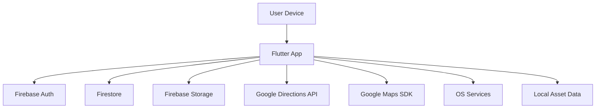

## Executive summary
The top risks center on integrity and privacy of user-submitted reports (precise location + photo) and the admin review workflow that promotes submissions into verified speed bump records. The repository shows strong server-side Firebase rules for owner- and admin-only access, but the system still depends on correct rules deployment, careful admin-claim management, and rate-limiting to prevent abuse. Secondary risks include abuse of the Google Directions API key (client-exposed) and availability issues from submission spam or large image processing.

## Scope and assumptions
- In-scope paths: `/Users/me/speed bump/lib`, `/Users/me/speed bump/firestore.rules`, `/Users/me/speed bump/storage.rules`, `/Users/me/speed bump/pubspec.yaml`, `/Users/me/speed bump/README.md`, `/Users/me/speed bump/SETUP.md`.
- Out-of-scope items: build artifacts and tooling (`/Users/me/speed bump/build`, `/Users/me/speed bump/.dart_tool`), tests (`/Users/me/speed bump/test`), platform-specific native code unless directly referenced by runtime, and unrelated top-level folders (`/Users/me/speed bump/NBAshowdown`, `/Users/me/speed bump/mcgplatform`, `/Users/me/speed bump/SpeedBumbps`).
- Assumption: the deployed system is the Flutter client plus Firebase Auth, Firestore, and Storage; there is no custom backend server.
- Assumption: Firestore and Storage rules in this repo are deployed in production as written.
- Assumption: admin access is granted only via Firebase custom claims set out of band (not in this repo).
- Assumption: the app is publicly accessible to anyone who can sign up (email/password or Google Sign-In).
- Assumption: submission data (photo + precise GPS + notes + user email) is considered sensitive personal data.
- Open question: is the web build deployed or only Android and iOS?
- Open question: what is the intended user scale and geographic scope (pilot vs public)?
- Open question: are there privacy or retention requirements for submission photos and locations?

## System model
### Primary components
- Flutter mobile client, navigation, and state management (`/Users/me/speed bump/lib/main.dart`, `/Users/me/speed bump/lib/core/routes/app_router.dart`).
- Firebase Auth for email/password and Google sign-in, plus admin claim checks (`/Users/me/speed bump/lib/features/auth/data/datasources/firebase_auth_datasource.dart`).
- Firestore for users, submissions, and speed bump records (`/Users/me/speed bump/lib/features/auth/data/datasources/firestore_user_datasource.dart`, `/Users/me/speed bump/lib/features/submission/data/datasources/firestore_submission_datasource.dart`, `/Users/me/speed bump/lib/features/admin/data/datasources/firestore_speed_bump_datasource.dart`).
- Firebase Storage for submission photos (`/Users/me/speed bump/lib/features/submission/data/datasources/firebase_storage_datasource.dart`).
- Google Directions API for routing and Google Maps SDK for map display (`/Users/me/speed bump/lib/features/routing/data/datasources/google_directions_api.dart`, `/Users/me/speed bump/lib/features/map/presentation/screens/map_screen.dart`).
- Local speed bump asset data (bundled JSON) used for routing display (`/Users/me/speed bump/lib/features/routing/data/repositories/asset_speed_bump_repository.dart`, `/Users/me/speed bump/lib/features/routing/presentation/providers/speed_bump_repository_provider.dart`).
- Admin review UI for approving or rejecting submissions (`/Users/me/speed bump/lib/features/admin/presentation/screens/admin_dashboard_screen.dart`, `/Users/me/speed bump/lib/features/admin/presentation/screens/review_submission_screen.dart`).

### Data flows and trust boundaries
- User device -> Firebase Auth. Data: email/password or Google OAuth tokens. Channel: HTTPS via Firebase SDK. Security: TLS, Firebase Auth token issuance. Validation: Firebase Auth backend; client-side form validation (`/Users/me/speed bump/lib/features/auth/presentation/screens/auth_screen.dart`, `/Users/me/speed bump/lib/features/auth/data/datasources/firebase_auth_datasource.dart`).
- User device -> Firestore (users collection). Data: user profile fields. Channel: HTTPS via Firestore SDK. Security: Firestore rules enforce owner/admin access. Validation: rules enforce field types and allowed keys (`/Users/me/speed bump/firestore.rules`, `/Users/me/speed bump/lib/features/auth/data/datasources/firestore_user_datasource.dart`).
- User device -> Firestore (submissions). Data: userId, userEmail, location, severity, notes, status, timestamps, photoUrl. Channel: HTTPS via Firestore SDK. Security: Firestore rules require auth and ownership; admin-only updates. Validation: rules enforce schema, status, and lat/lng bounds (`/Users/me/speed bump/firestore.rules`, `/Users/me/speed bump/lib/features/submission/data/datasources/firestore_submission_datasource.dart`, `/Users/me/speed bump/lib/features/submission/data/models/submission_model.dart`).
- User device -> Firestore (speed_bumps). Data: location, severity, report count, verification metadata. Channel: HTTPS via Firestore SDK. Security: admin-only create/update. Validation: rules enforce schema and ranges (`/Users/me/speed bump/firestore.rules`, `/Users/me/speed bump/lib/features/admin/data/datasources/firestore_speed_bump_datasource.dart`).
- User device -> Firebase Storage (submission photos). Data: image files, metadata. Channel: HTTPS via Storage SDK. Security: Storage rules require auth, owner path, size, and content type (`/Users/me/speed bump/storage.rules`, `/Users/me/speed bump/lib/features/submission/data/datasources/firebase_storage_datasource.dart`).
- User device -> Google Directions API. Data: origin, destination, waypoints. Channel: HTTPS via HTTP client. Security: API key in client; TLS. Validation: none in app (`/Users/me/speed bump/lib/core/constants/api_constants.dart`, `/Users/me/speed bump/lib/features/routing/data/datasources/google_directions_api.dart`).
- User device -> OS services (GPS, camera, file system). Data: location and photos. Channel: platform APIs. Security: OS permission model. Validation: app checks permissions and handles errors (`/Users/me/speed bump/lib/features/map/data/repositories/geolocator_location_repository.dart`, `/Users/me/speed bump/lib/features/submission/presentation/screens/camera_screen.dart`).
- User device -> Local EXIF parsing. Data: image bytes. Channel: local file IO. Security: none beyond app sandbox. Validation: try/catch and type checks (`/Users/me/speed bump/lib/core/utils/exif_extractor.dart`).

#### Diagram

## Assets and security objectives
| Asset | Why it matters | Security objective (C/I/A) |
| --- | --- | --- |
| Submission photos and metadata (location, notes, userId, userEmail) | Sensitive location and identity data; privacy risk | C, I |
| Admin review decisions and speed bump records | Integrity of public safety data and user trust | I, A |
| Firebase Auth tokens and session state | Controls access to user data and admin workflows | C, I |
| Firebase Storage objects (submission photos) | Privacy exposure if access control fails | C |
| Firestore submissions collection | User privacy and integrity of reports | C, I |
| Google Directions API key | Quota and billing exposure | C, A |
| App availability (routing, submission flows) | User experience and safety workflow availability | A |

## Attacker model
### Capabilities
- Remote attacker can install the app, create a normal user account, and authenticate.
- Attacker can modify the client or use API tooling to call Firebase endpoints within the limits of Firebase rules.
- Attacker can submit photos and location data, including spoofed GPS/EXIF metadata.
- Attacker can attempt to extract client-embedded API keys from the app binary.

### Non-capabilities
- Attacker cannot bypass Firestore or Storage rules if they are deployed as written.
- Attacker cannot set the Firebase custom admin claim from the client.
- Attacker cannot read other users' submissions or photos without admin privileges under current rules.

## Entry points and attack surfaces
| Surface | How reached | Trust boundary | Notes | Evidence (repo path / symbol) |
| --- | --- | --- | --- | --- |
| Email/password login | Auth screen -> Firebase Auth | User device -> Firebase Auth | Credentials and token issuance | `/Users/me/speed bump/lib/features/auth/presentation/screens/auth_screen.dart`; `/Users/me/speed bump/lib/features/auth/data/datasources/firebase_auth_datasource.dart` |
| Google sign-in | Auth screen -> Google Sign-In -> Firebase Auth | User device -> Firebase Auth | OAuth token exchange | `/Users/me/speed bump/lib/features/auth/data/datasources/firebase_auth_datasource.dart` |
| Submission create | Submission form -> Firestore | User device -> Firestore | Includes location, severity, notes, photoUrl | `/Users/me/speed bump/lib/features/submission/presentation/screens/submission_form_screen.dart`; `/Users/me/speed bump/lib/features/submission/data/repositories/firebase_submission_repository.dart` |
| Submission photo upload | Submission flow -> Storage | User device -> Storage | Image upload and download URL | `/Users/me/speed bump/lib/features/submission/data/datasources/firebase_storage_datasource.dart`; `/Users/me/speed bump/storage.rules` |
| User submission reads | My Submissions screen -> Firestore | User device -> Firestore | Reads own submissions only | `/Users/me/speed bump/lib/features/submission/presentation/screens/submission_history_screen.dart`; `/Users/me/speed bump/firestore.rules` |
| Admin pending submissions | Admin dashboard -> Firestore | User device -> Firestore | Admin-only query | `/Users/me/speed bump/lib/features/admin/presentation/providers/pending_submissions_provider.dart`; `/Users/me/speed bump/firestore.rules` |
| Admin approve/reject | Review screen -> Firestore | User device -> Firestore | Admin-only updates; creates speed_bumps | `/Users/me/speed bump/lib/features/admin/presentation/screens/review_submission_screen.dart`; `/Users/me/speed bump/lib/features/admin/data/repositories/firebase_admin_repository.dart` |
| Directions API requests | Routing -> HTTP client | User device -> Google API | Keyed requests with location data | `/Users/me/speed bump/lib/features/routing/data/datasources/google_directions_api.dart`; `/Users/me/speed bump/lib/core/constants/api_constants.dart` |
| EXIF parsing | Submission flow -> local file IO | Local file boundary | Parses EXIF from user image | `/Users/me/speed bump/lib/core/utils/exif_extractor.dart` |

## Top abuse paths
1. AP-1: Step 1: attacker gains or is granted an admin claim. Step 2: attacker reads submissions and photos and edits speed_bumps. Step 3: privacy breach and integrity loss of map data.
2. AP-2: Step 1: operator deploys Firebase without these rules (test mode or drift). Step 2: attacker reads or writes submissions and photos without restrictions. Step 3: mass privacy exposure and data corruption.
3. AP-3: Step 1: authenticated attacker scripts mass submissions and uploads. Step 2: admin queue floods and storage costs rise. Step 3: service availability and trust degrade.
4. AP-4: Step 1: attacker submits spoofed location or reused photos. Step 2: admin approves due to limited verification. Step 3: speed_bumps dataset becomes inaccurate and routing is degraded.
5. AP-5: Step 1: attacker extracts Google Directions API key from app binary. Step 2: attacker issues high-volume requests. Step 3: quota exhaustion or unexpected billing.
6. AP-6: Step 1: attacker crafts submission with misleading userEmail or notes. Step 2: admin workflow relies on metadata in review. Step 3: impersonation or social engineering within review context.
7. AP-7: Step 1: attacker uploads malformed or oversized images with tricky EXIF. Step 2: client-side parsing or compression fails. Step 3: app crash or degraded submission UX.

## Threat model table
| Threat ID | Threat source | Prerequisites | Threat action | Impact | Impacted assets | Existing controls (evidence) | Gaps | Recommended mitigations | Detection ideas | Likelihood | Impact severity | Priority |
| --- | --- | --- | --- | --- | --- | --- | --- | --- | --- | --- | --- | --- |
| TM-001 | Operator misconfig | Firebase rules not deployed or drift from repo rules | Unauthorized read/write of submissions and photos | Large-scale privacy exposure; integrity loss | Submissions, Storage photos | Intended rules in repo (`/Users/me/speed bump/firestore.rules`, `/Users/me/speed bump/storage.rules`) | Manual deployment step; no automated enforcement in repo | Automate rules deployment in CI; add monitoring for rules changes; verify prod rules match repo | Monitor Firebase audit logs and config changes | Medium | High | high |
| TM-002 | Compromised admin | Attacker obtains admin claim via account takeover or misassignment | Read all submissions and approve/reject or create speed_bumps | Privacy breach and dataset corruption | Submissions, speed_bumps | Admin-only rules (`/Users/me/speed bump/firestore.rules`); admin claim check (`/Users/me/speed bump/lib/features/auth/data/datasources/firebase_auth_datasource.dart`) | No in-repo admin-claim management; minimal auditing | Use least-privilege admin roles; require admin MFA; log admin actions; add approval history | Alerts on admin actions, unusual approval rates | Low | High | high |
| TM-003 | Authenticated user | Valid account; submissions allowed | Spam submissions and uploads to increase cost and backlog | Availability/cost impact; review overload | Firestore, Storage, admin workflow | Storage size limits and content-type checks (`/Users/me/speed bump/storage.rules`) | No rate limits or per-user quotas | Add per-user rate limits or quotas; throttle submissions; require reputation/verification | Track submission rate per user; alerts on spikes | Medium | Medium | medium |
| TM-004 | Authenticated user | Valid account; admin review relies on manual verification | Submit false or spoofed reports that get approved | Integrity loss in speed_bumps dataset | speed_bumps, user trust | Admin approval required (`/Users/me/speed bump/firestore.rules`); admin workflow (`/Users/me/speed bump/lib/features/admin/data/repositories/firebase_admin_repository.dart`) | No automated validation or duplicate detection | Add duplicate detection, geospatial clustering checks, and multi-report confirmation | Monitor approval to rejection ratio; anomaly detection | Medium | Medium | medium |
| TM-005 | External attacker | Ability to extract client API key | Abuse Google Directions API key for high-volume calls | Quota exhaustion, increased billing, routing degradation | Google Directions API key, routing availability | Key loaded via build-time define (`/Users/me/speed bump/lib/core/constants/api_constants.dart`) | Client-exposed key; no server proxy | Restrict key to app package/signing; monitor usage; consider proxying requests | Monitor API usage quotas and referrer anomalies | Medium | Medium | medium |
| TM-006 | Authenticated user | Valid account; submission fields not fully validated | Submit misleading userEmail or notes to impersonate or mislead admin | Admin confusion; minor integrity impact | Submission metadata | Rules only enforce type, not match to auth (`/Users/me/speed bump/firestore.rules`); model includes userEmail (`/Users/me/speed bump/lib/features/submission/data/models/submission_model.dart`) | No server-side binding of userEmail to auth | Remove userEmail from client input; derive from auth on server; show only uid in admin UI | Review logs for mismatched profiles | Medium | Low | low |
| TM-007 | Authenticated user | Ability to upload crafted images | Trigger client-side EXIF or image decode failures | Client crash or degraded UX | App availability | Try/catch in EXIF extractor (`/Users/me/speed bump/lib/core/utils/exif_extractor.dart`); compression limits (`/Users/me/speed bump/lib/core/utils/image_compressor.dart`) | No server-side sanitization; limited validation | Strip EXIF on upload; validate image dimensions and type before processing | Crash analytics; track upload failures | Low | Low | low |

## Criticality calibration
- Critical: Cross-user data exposure at scale or full compromise of admin workflow. Examples: production rules disabled leading to public access; compromised admin account changing or exposing all submissions.
- High: Major privacy or integrity impact affecting many users or the dataset. Examples: admin claim misassignment; large-scale submission spam causing service disruption.
- Medium: Abuse with bounded impact or mitigations available. Examples: API key scraping causing quota pressure; false submissions that require admin approval.
- Low: Limited-impact issues or edge-case crashes. Examples: malformed EXIF causing local app crash; misleading submission notes.

## Focus paths for security review
| Path | Why it matters | Related Threat IDs |
| --- | --- | --- |
| `/Users/me/speed bump/firestore.rules` | Core access control and schema enforcement | TM-001, TM-002, TM-003, TM-004, TM-006 |
| `/Users/me/speed bump/storage.rules` | Access control for user photos | TM-001, TM-003, TM-007 |
| `/Users/me/speed bump/lib/features/auth/data/datasources/firebase_auth_datasource.dart` | Admin claim checks and auth flows | TM-002 |
| `/Users/me/speed bump/lib/features/submission/data/datasources/firestore_submission_datasource.dart` | Submission create/read/update logic | TM-003, TM-004, TM-006 |
| `/Users/me/speed bump/lib/features/submission/data/datasources/firebase_storage_datasource.dart` | Photo upload and download URL creation | TM-003, TM-007 |
| `/Users/me/speed bump/lib/features/submission/data/models/submission_model.dart` | Submission fields and mapping | TM-004, TM-006 |
| `/Users/me/speed bump/lib/features/admin/data/repositories/firebase_admin_repository.dart` | Admin approval flow and speed_bumps creation | TM-002, TM-004 |
| `/Users/me/speed bump/lib/features/routing/data/datasources/google_directions_api.dart` | Client-side API key usage and requests | TM-005 |
| `/Users/me/speed bump/lib/core/constants/api_constants.dart` | API key management | TM-005 |
| `/Users/me/speed bump/lib/core/utils/exif_extractor.dart` | EXIF parsing surface | TM-007 |
| `/Users/me/speed bump/SETUP.md` | Manual deployment steps for rules and keys | TM-001, TM-005 |

## Notes on use
- This report assumes the Firebase rules in `/Users/me/speed bump/firestore.rules` and `/Users/me/speed bump/storage.rules` are deployed; re-rank TM-001 if production differs.
- If a web build is deployed, re-evaluate browser-specific threats such as XSS and token storage risks.
- Quality check: all discovered entry points are covered.
- Quality check: each trust boundary appears in at least one threat.
- Quality check: runtime behavior is separated from CI/dev artifacts.
- Quality check: user non-response is reflected via explicit assumptions and open questions.
- Quality check: assumptions and open questions are explicit.
